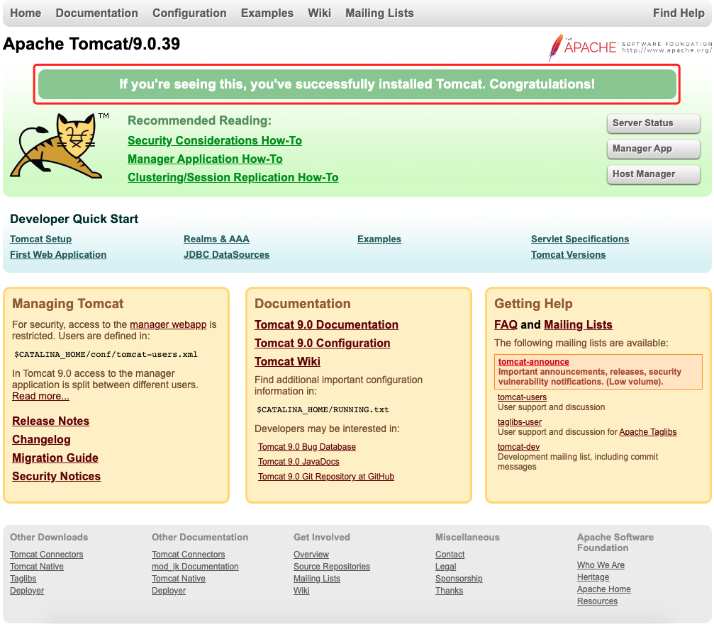
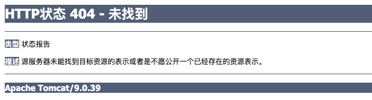

# Spring MVC

https://www.jianshu.com/p/91a2d0a1e45a

https://mp.weixin.qq.com/s?__biz=MzI4Njg5MDA5NA==&mid=2247483775&idx=1&sn=c9d7ead744c6e0c3ab2fe55c09bbe61f&chksm=ebd7407edca0c9688f3870d895b760836101271b912899821fb35c5704fe215da2fc5daff2f9#rd

https://www.runoob.com/jsp/eclipse-jsp.html


```xml
<!-- https://mvnrepository.com/artifact/junit/junit -->
<dependency>
    <groupId>junit</groupId>
    <artifactId>junit</artifactId>
    <version>4.13.1</version>
    <scope>test</scope>
</dependency>
```


```xml
<!-- https://mvnrepository.com/artifact/org.springframework/spring-webmvc -->
<dependency>
    <groupId>org.springframework</groupId>
    <artifactId>spring-webmvc</artifactId>
    <version>5.2.9.RELEASE</version>
</dependency>
```


```xml
<!-- https://mvnrepository.com/artifact/javax.servlet/servlet-api -->
<dependency>
    <groupId>javax.servlet</groupId>
    <artifactId>servlet-api</artifactId>
    <version>2.5</version>
    <scope>provided</scope>
</dependency>
```


```xml
<!-- https://mvnrepository.com/artifact/javax.servlet.jsp/jsp-api -->
<dependency>
    <groupId>javax.servlet.jsp</groupId>
    <artifactId>jsp-api</artifactId>
    <version>2.2</version>
    <scope>provided</scope>
</dependency>
```


```xml
<!-- https://mvnrepository.com/artifact/javax.servlet/jstl -->
<dependency>
    <groupId>javax.servlet</groupId>
    <artifactId>jstl</artifactId>
    <version>1.2</version>
</dependency>
```


```bash
The default interactive shell is now zsh.
To update your account to use zsh, please run `chsh -s /bin/zsh`.
For more details, please visit https://support.apple.com/kb/HT208050.
YF-11117846M2:Tomcat 11117846$ sudo chmod 755 /Library/Tomcat
Password:
Sorry, try again.
Password:
YF-11117846M2:Tomcat 11117846$ sudo sh startup.sh
sh: startup.sh: No such file or directory
YF-11117846M2:Tomcat 11117846$ sudo ./startup.sh start
sudo: ./startup.sh: command not found
YF-11117846M2:Tomcat 11117846$ pwd
/Library/Tomcat
YF-11117846M2:Tomcat 11117846$ cd bin
YF-11117846M2:bin 11117846$ ls
bootstrap.jar			makebase.sh
catalina-tasks.xml		setclasspath.bat
catalina.bat			setclasspath.sh
catalina.sh			shutdown.bat
ciphers.bat			shutdown.sh
ciphers.sh			startup.bat
commons-daemon-native.tar.gz	startup.sh
commons-daemon.jar		tomcat-juli.jar
configtest.bat			tomcat-native.tar.gz
configtest.sh			tool-wrapper.bat
daemon.sh			tool-wrapper.sh
digest.bat			version.bat
digest.sh			version.sh
makebase.bat
YF-11117846M2:bin 11117846$ sudo sh startup.sh
Using CATALINA_BASE:   /Library/Tomcat
Using CATALINA_HOME:   /Library/Tomcat
Using CATALINA_TMPDIR: /Library/Tomcat/temp
Using JRE_HOME:        /Library/Java/JavaVirtualMachines/jdk1.8.0_261.jdk/Contents/Home
Using CLASSPATH:       /Library/Tomcat/bin/bootstrap.jar:/Library/Tomcat/bin/tomcat-juli.jar
Using CATALINA_OPTS:   
Tomcat started.
YF-11117846M2:bin 11117846$ 
```





Error running Tomcat 8.5.31: Error copying configuration files from /usr/local/apache-tomcat-8.5.3/conf to /Users/zhouyuchen/Library/Caches/IntelliJIdea2016.1/tomcat/Tomcat_8_5_31_ttt/conf: Directory is invalid /usr/local/apache-tomcat-8.5.3/conf/Catalina

https://www.cnblogs.com/wang715100018066/archive/2004/01/13/10451719.html




说明路径有问题，核对路径！


com.ly.servlet.HelloServlet

```java
package com.ly.servlet;

import javax.servlet.ServletException;
import javax.servlet.http.HttpServlet;
import javax.servlet.http.HttpServletRequest;
import javax.servlet.http.HttpServletResponse;
import java.io.IOException;

public class HelloServlet extends HttpServlet {
    @Override
    protected void doGet(HttpServletRequest req, HttpServletResponse resp) throws ServletException, IOException {
        // 1、获取前端参数
        String method = req.getParameter("method");
        if (method.equals("add")){
            req.getSession().setAttribute("msg","执行了add方法");
        }
        if (method.equals("delete")){
            req.getSession().setAttribute("msg","执行了delete方法");
        }
        // 2、业务逻辑，调用业务层（暂无）
        // 3、视图转发或者重定向 web/WEB-INF/jsp/hello.jsp
        req.getRequestDispatcher("/WEB-INF/jsp/hello.jsp").forward(req, resp);
    }

    @Override
    protected void doPost(HttpServletRequest req, HttpServletResponse resp) throws ServletException, IOException {
            doGet(req, resp);
    }
}
```


[Spring5源码解析-Spring中的处理器handlers](https://muyinchen.github.io/2017/08/05/Spring5%E6%BA%90%E7%A0%81%E8%A7%A3%E6%9E%90-Spring%E4%B8%AD%E7%9A%84%E5%A4%84%E7%90%86%E5%99%A8handlers/)


[SpringMVC介绍之视图解析器ViewResolver](https://developer.aliyun.com/article/459921)


[Jackson 快速入门](https://segmentfault.com/a/1190000023218408)


标签【<script type='text/javascript'>】是什么意思 ？

是说明这一段脚本语言是javascript。 告诉浏览器这一段要按照javascript来解释执行。